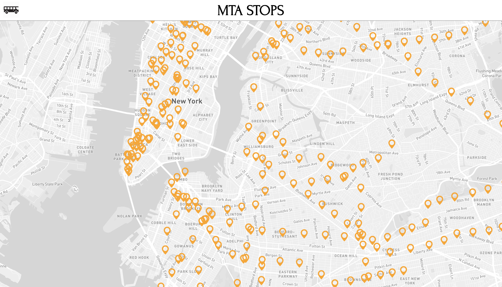

# mta-stops

## To install

- Install MongoDB and run
- Confirm installation of dependencies like GTFS and react-map-gl after npm install
- This project was created using Node version 10.15.3

## Launch command

**npm run dev**

This project will run at http://localhost:3000

